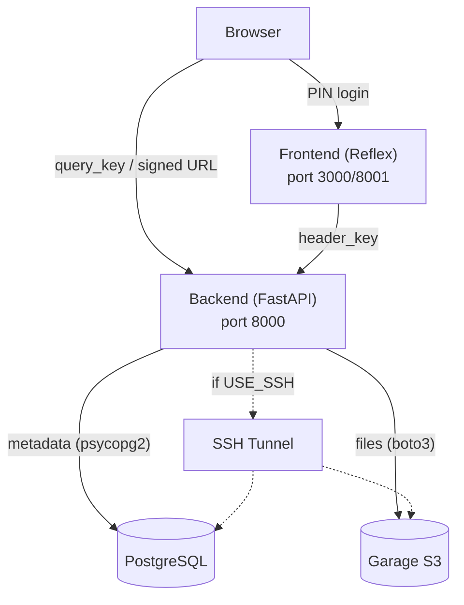

# Architecture

## Diagram

- **Browser ↔ Backend**: direct, using `query_key` (images) or a signed URL (`/stream/{file}?expires&signature`, HMAC-SHA256, 15-min expiry) for video — avoids proxying bytes through the Reflex frontend.
- **Frontend ↔ Backend**: server-to-server calls using `header_key` (hidden, more secure).
- **Backend ↔ DB/Garage**: direct, or via SSH tunnel to `127.0.0.1` when `USE_SSH=true`.

## Elements

| Element | Tech | Entry Point | Notes |
|---|---|---|---|
| Frontend | Reflex | `frontend/frontend/frontend.py` | `State(rx.State)` = logic, `login()`/`gallery()` = pages, lazy-loads thumbnails via `on_intersect` |
| Backend | FastAPI + uvicorn | `backend/main.py` | REST API for objects/metadata; opens DB/Garage/SSH connections at import time |
| PostgreSQL | psycopg2 | `${DB_SCHEMA}.${DB_TABLE}` | Metadata only: `key, original_filename, file_type, size, device, uploaded_date, created_date, tag, is_img` |
| Garage | boto3 (S3 API) | `${BUCKET_NAME}` | File bytes, keyed by `<uuid>.<ext>` |
| SSH Tunnel | sshtunnel | toggled by `USE_SSH` | Forwards DB/Garage ports to `127.0.0.1` for remote hosting |
| Compose | Docker Compose | `docker-compose.yml` | `backend` + `frontend` services on `ggallery-network` |

## Auth Methods

1. **Header key** — server-to-server (Frontend → Backend). Most secure, hidden from browser.
2. **Query key** — browser-to-backend (images). Exposes the raw `API_KEY` in the URL; only option since `` can't set headers.
3. **Signed URL** — browser-to-backend (video). Scoped, time-limited HMAC signature; safer than a query key but still proxies bytes through the backend rather than Garage directly (not a true presigned URL).

## Data Flow

1. **Upload** → validate extension → extract metadata (`mediameta`) → write row to Postgres → upload bytes to Garage.
2. **List/filter** → `GET /objects/` or `/objects/filter` (by date, tag, type).
3. **View image** → browser fetches `/object/{key}?query_key=...` directly.
4. **View video** → backend issues a signed `/stream/{key}` URL → browser streams with Range requests.
5. **Tag** → `PATCH /object/{key}/tag`.
